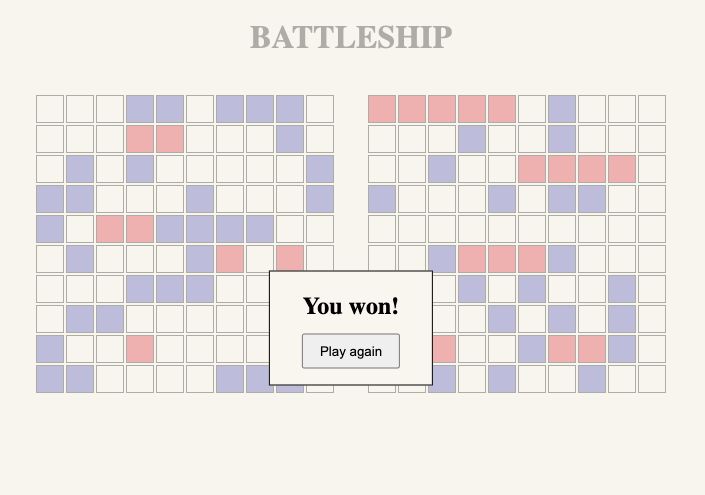

# Battleship

Goals:

- Use test-driven development practices.
- Become familiar with Jest.
- Implement a game with multiple boards.
- Create multiple popup elements from scratch.

[Check out the live version here!](https://jakenead.github.io/battleship/)

